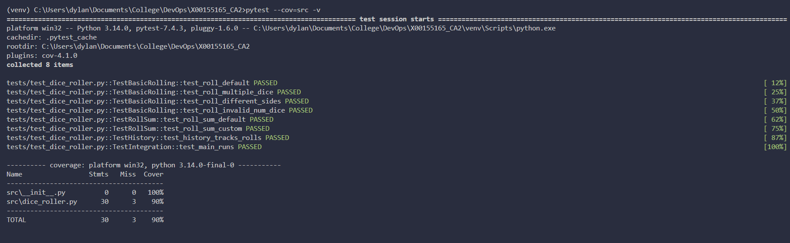
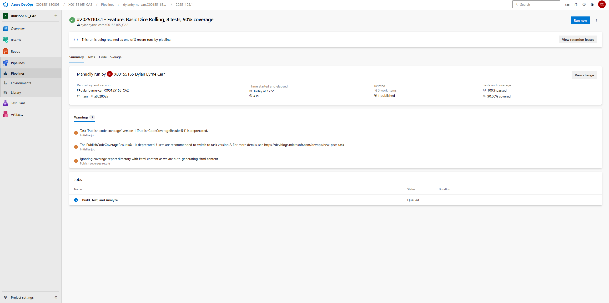
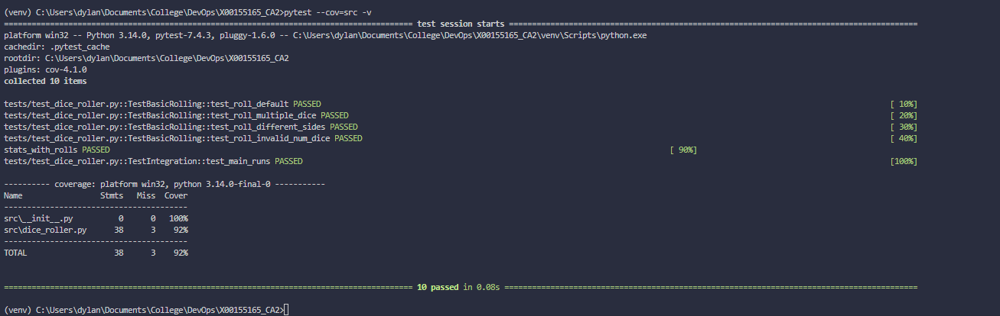
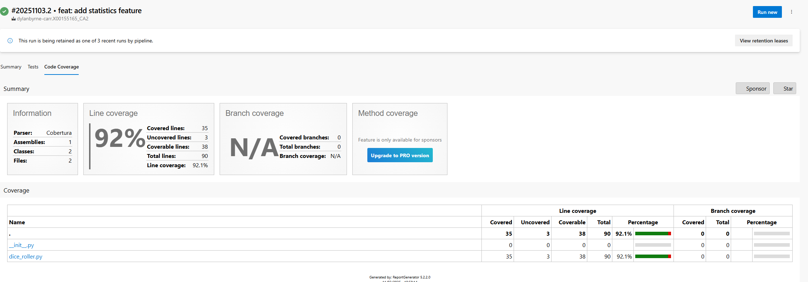
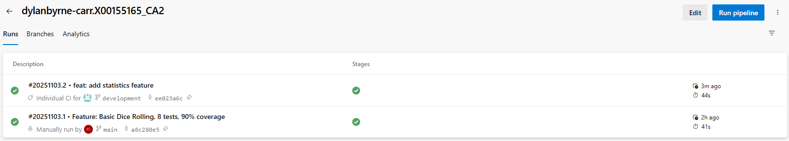
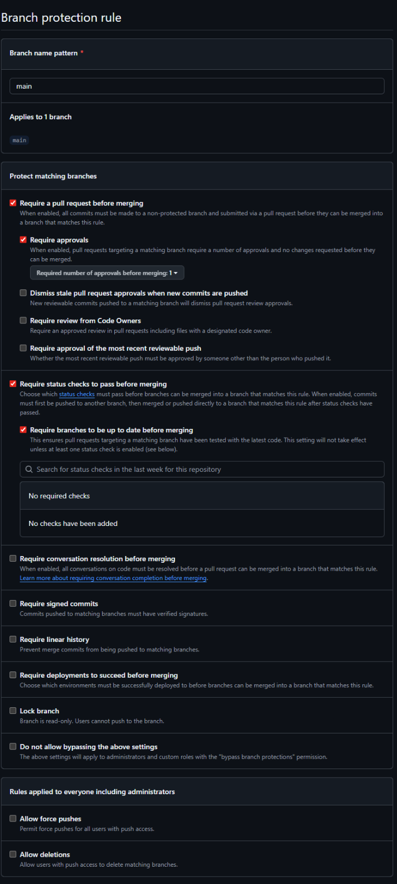
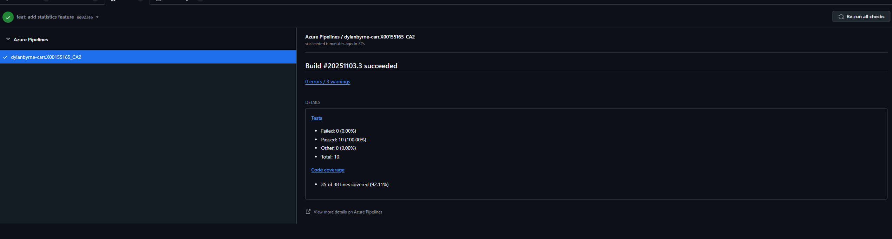
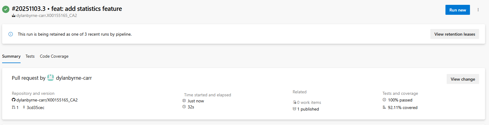
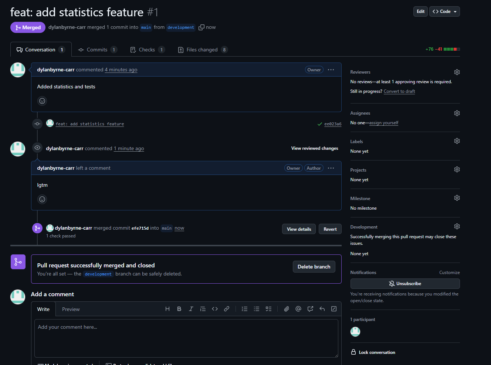
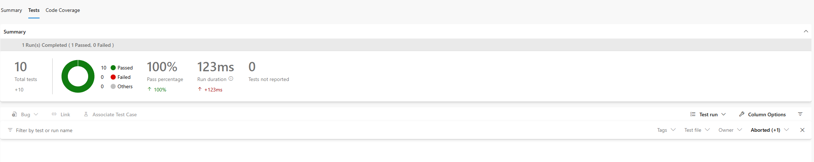

# Dice Roller Application

**Student:** Dylan Byrne-Carr  
**Student Number:** X00155165  
**Module:** DevOps - Continuous Integration and Deployment (DOCID)

---

## Overview

A Python dice rolling application demonstrating professional CI/CD practices through iterative development. This project showcases automated testing, continuous integration with Azure Pipelines, branch protection workflows, and statistical analysis features.

**Development Approach:** Two-phase implementation demonstrating real-world DevOps workflows

- **Phase 1:** Basic dice rolling with history tracking
- **Phase 2:** Statistical analysis added via Pull Request validation

---

## Technologies Used

- **Language:** Python 3.14
- **Testing Framework:** pytest 7.4.3
- **Coverage Tool:** pytest-cov 4.1.0 (Cobertura format)
- **Static Analysis:** Pylint 3.0.3
- **CI/CD Platform:** Azure Pipelines (YAML-based)
- **Version Control:** Git/GitHub with branch protection
- **Development Environment:** VS Code

---

## Local Development Setup

### Prerequisites

- Python 3.11 or higher
- Git
- pip package manager

### Installation Steps

1. **Clone the repository**

   ```bash
   git clone https://github.com/dylanbyrne-carr/X00155165_CA2.git
   cd X00155165_CA2
   ```

2. **Create and activate virtual environment**

   ```bash
   python -m venv venv

   # Windows
   venv\Scripts\activate

   # Mac/Linux
   source venv/bin/activate
   ```

3. **Install dependencies**

   ```bash
   pip install -r requirements.txt
   ```

4. **Run the application**

   ```bash
   python src/dice_roller.py
   ```

5. **Run tests with coverage**
   ```bash
   pytest --cov=src --cov-report=html
   ```

---

## Application Features

### Feature 1: Basic Dice Rolling

**Methods:**

- `roll(num_dice=1, sides=6)` - Roll one or more dice
- `roll_sum(num_dice=2, sides=6)` - Roll and sum results
- `get_history()` - Retrieve roll history
- `clear_history()` - Reset history

**Example:**

```python
from src.dice_roller import DiceRoller

roller = DiceRoller()
result = roller.roll(3, 6)  # Roll 3d6
total = roller.roll_sum(2, 6)  # Roll 2d6 and sum
```

### Feature 2: Statistical Analysis

**Methods:**

- `get_stats()` - Returns {'average', 'min', 'max', 'count'}

**Example:**

```python
stats = roller.get_stats()
print(f"Average: {stats['average']:.2f}")
```

---

## CI/CD Pipeline

### Pipeline Configuration

**File:** `azure-pipelines.yaml`

**Key Features:**

- Uses `UsePythonVersion@0` task
- Generates Cobertura XML coverage reports
- **Enforces 80% coverage threshold** (build fails if below)
- Publishes coverage results to Azure DevOps
- Runs Pylint for code quality analysis
- Triggers on `main` and `development` branches

**Coverage Enforcement:**

```yaml
- script: |
    COVERAGE=$(python -c "...")
    if (( $(echo "$COVERAGE < 80" | bc -l) )); then
      exit 1
    fi
  displayName: "Enforce 80% coverage threshold"
```

### Phase 1: Initial Implementation

**Metrics:**

- Tests: 8 passing
- Coverage: 90%
- Pipeline: Success




### Phase 2: Feature Addition via Pull Request

**Metrics:**

- Tests: 10 passing
- Coverage: 92%
- Pipeline: Success





---

## Branch Protection & Pull Request Workflow

### Branch Strategy

- **`main`:** Production-ready code, protected
- **`development`:** Integration branch for new features

### Protection Rules



**Enabled:**

1. Require pull request before merging
2. Require status checks to pass
3. Require branches to be up to date

### Pull Request Workflow





**Process:**

1. Developer creates feature branch
2. Pushes changes
3. Creates Pull Request
4. Pipeline validates automatically
5. Merge only after checks pass

---

## Testing

### Test Organization

**File:** `tests/test_dice_roller.py`

**Test Classes:**

- `TestBasicRolling` (4 tests)
- `TestRollSum` (2 tests)
- `TestHistory` (1 test)
- `TestStatistics` (2 tests)
- `TestIntegration` (1 test)

**Total:** 10 tests, 92% coverage



### Running Tests

```bash
# Run all tests
pytest -v

# With coverage
pytest --cov=src --cov-report=term

# Generate HTML report
pytest --cov=src --cov-report=html
open htmlcov/index.html
```

---

## Static Code Analysis

**Tool:** Pylint 3.0.3

**Running:**

```bash
pylint src/ --reports=y
```

**Pipeline Integration:**
Runs automatically on every commit, providing continuous code quality feedback.

## Development Timeline

**Phase 1:** Basic dice rolling, 8 tests, 90% coverage  
**Phase 2:** Statistical analysis via PR, 10 tests, 92% coverage

---

## Project Links

- **GitHub Repository:** https://github.com/dylanbyrne-carr/X00155165_CA2
- **Azure DevOps Project:** https://dev.azure.com/X00155165080808/X00155165_CA2
- **Screencast:** https://tudublin-my.sharepoint.com/:v:/g/personal/x00155165_mytudublin_ie1/EbUoKCWlLatMnsLTHxDxK-IBMfwhJ12A08lnGSANuz8VqQ?nav=eyJyZWZlcnJhbEluZm8iOnsicmVmZXJyYWxBcHAiOiJPbmVEcml2ZUZvckJ1c2luZXNzIiwicmVmZXJyYWxBcHBQbGF0Zm9ybSI6IldlYiIsInJlZmVycmFsTW9kZSI6InZpZXciLCJyZWZlcnJhbFZpZXciOiJNeUZpbGVzTGlua0NvcHkifX0&email=Dariusz.Terefenko%40TUDublin.ie&e=bNMw9N

_Last Updated: November 14, 2025_
